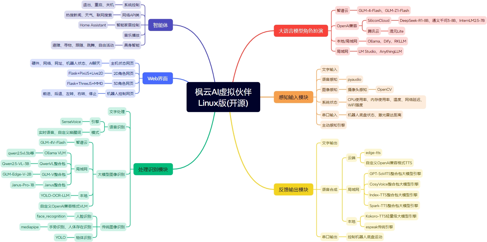

# 枫云AI虚拟伙伴Linux版

  

**枫云AI虚拟伙伴Linux版** 是一款由MewCo-AI团队开源的可随身携带且支持本地运行的AI伙伴，旨在为Linux用户打造一个功能丰富、高度可定制的虚拟伙伴。通过整合多种人工智能技术，实现实时拟真语音交互、多模态图像识别、多Agent智能体、Live2D/MMD 3D角色展示等功能。


## 功能特性
- **适配ARM小型设备**：可在香橙派、树莓派、Orin等Linux ARM小型设备上运行，便于随身携带；也支持在VMware X86虚拟机上运行。
- **广泛的开源AI生态**：对接多种云端/局域网/本地大语言模型、多模态模型、语音合成大模型，兼容OpenAI标准API。
- **实时拟真语音交互**：通过SenseVoice本地ASR引擎实现实时语音识别，支持流畅的语音交流。
- **多模态图像识别**：支持摄像头内容的多模态图像理解问答、人脸识别。
- **本地知识库**：对接局域网AnythingLLM、局域网/本地Dify聊天助手提升虚拟伙伴的理解与回应精度。
- **多设备全平台访问**：在Linux主机上运行后，局域网内的设备(如电脑、手机、平板)可通过浏览器展示虚拟伙伴。
- **多Agent智能体**：支持联网搜索、新闻查询、天气查询、Home Assistant智能家居控制等智能体，可自定义扩展function.py实现更多功能。
- **丰富的自定义设置**：用户可自定义虚拟伙伴的名称、语音、人设、Live2D/MMD 3D角色模型等，并个性化配置ASR、TTS、LLM、VLM等模块。



### 大语言模型角色扮演
1. **智谱云**
    - 支持GLM-4-Flash、GLM-Z1-Flash等模型。
2. **OpenAI兼容(以下仅列举免费模型,可自由寻找其他模型)**
    - **SiliconCloud**：支持DeepSeek-R1-7B、通义千问3-8B、InternLM2.5-7B等模型。
    - **讯飞云**：支持星火Lite等模型。
    - **腾讯云**：支持混元Lite等模型。
3. **本地/局域网**
    - **Ollama**：在本地部署和使用模型，无网环境畅玩。
    - **Dify**：支持本地知识库，实现更优角色扮演聊天。
4. **局域网**
    - **LM Studio**：对接局域网内本地部署的模型。
    - **AnythingLLM**：支持本地知识库，实现更优角色扮演聊天。

### 感知输入模块
1. **文字输入**：通过命令行输入文字与虚拟伙伴进行交互。
2. **语音感知**：使用pyaudio库实现麦克风音频采集。
3. **图像感知**：通过OpenCV库实现摄像头画面捕捉。
4. **系统状态**：实时获取CPU使用率、内存使用率、温度、网络延迟、WiFi强度等系统信息。

### 反馈输出模块
1. **文字输出**：在命令行中显示虚拟伙伴的回答和相关信息。
2. **语音合成**
    - **云端**：对接云端edge-tts、自定义TTS语音合成。
    - **局域网**：支持GPT-SoVITS、CosyVoice、Index-TTS、Spark-TTS整合包大模型引擎。
    - **本地**：内置Kokoro-TTS轻量级大模型引擎和对接espeak传统引擎。

### 处理识别模块
1. **文字处理**：对用户输入的文字进行解析和处理，提取关键信息，调用相应的功能模块。
2. **语音识别**
    - **引擎**：使用SenseVoice作为语音识别引擎，支持高准确率多语言语音转文字功能。
    - **模式**：支持实时语音模式和自定义唤醒词模式，用户可根据使用场景选择合适的模式。
3. **图像识别**：整合多种图像识别引擎，如智谱云的GLM-4V-Flash、局域网的Ollama VLM、QwenVL、GLM-V、Janus整合包、本地的集成YOLO-OCR-LLM以及OpenAI兼容的相关模型，实现对图像中物体、场景、文字等内容的识别和分析。
4. **人脸识别**：利用face_recognition库实现人脸识别功能，用户可录入人脸信息，虚拟伙伴能够识别用户身份。

### Web界面
1. **2D角色网页**：采用Flask+PixiJS+Live2D技术，提供一个2D角色展示界面，用户可通过浏览器访问。
2. **3D角色网页**：采用Flask+ThreeJS+MMD技术，实现一个3D角色展示和动作播放界面，用户可通过浏览器访问。

### 智能体
1. **系统控制**：支持退出、重启、关机等系统控制指令。
2. **网络API类**：提供热搜新闻查询、天气查询、联网搜索等功能。
3. **智能家居控制**：对接Home Assistant API，实现对灯类智能家居设备的控制。
4. **音乐播放**：支持播放本地音乐文件。

## 安装指南
### 环境要求
- **操作系统**：Ubuntu22.04或更高版本
- **Python版本**：3.12
- **处理器**：RK3588S(香橙派5 Pro) / BCM2712(树莓派5)系列 / Intel i5 8th / AMD R5 3000
- **内存**：4GB RAM(最低)  8GB RAM(推荐)
- **存储空间**：至少4GB可用空间
- **网络**：支持联网使用，也支持下载本地AI引擎DLC离线使用
- **麦克风**：0.5米拾音(语音输入需求)
- **摄像头**：720P彩色(多模态图像识别需求)

### 下载和安装
#### 方法一：通过源码安装
1. 下载项目：
```bash
git clone https://github.com/swordswind/ai_virtual_mate_linux.git
cd ai_virtual_mate_linux
```
2. 安装系统依赖：
```bash
sudo apt install cmake libasound-dev portaudio19-dev libportaudio2 libportaudiocpp0 espeak
```
3. 安装Python依赖(分别执行以下命令，请忽略红字冲突提示，不影响正常使用)：
```bash
pip install -r requirements.txt
pip install kokoro_onnx==0.4.5
pip install numpy==1.26.4
```
4. 下载必备AI模型包：
从[本链接](https://pan.baidu.com/s/1cvUyHLC9Di36gjzTUtCSfw?pwd=aivm)下载必备AI模型包 model.zip，解压后放入data/model文件夹

#### 方法二：自带模型的整合包
1. 下载项目：
从[项目官网](https://swordswind.github.io/2025/05/17/matelinux/)下载自带模型的整合包ai_virtual_mate_linux.zip并解压
```bash
cd ai_virtual_mate_linux
```
2. 安装系统依赖：
```bash
sudo apt install cmake libasound-dev portaudio19-dev libportaudio2 libportaudiocpp0 espeak
```
3. 安装Python依赖(分别执行以下命令，请忽略红字冲突提示，不影响正常使用)：
```bash
pip install -r requirements.txt
pip install kokoro_onnx==0.4.5
pip install numpy==1.26.4
```

### 测试硬件接口
进入test文件夹，分别运行4个测试程序来查看摄像头、麦克风、温度传感器、无线网卡的接口编号，后续进入config.py配置能用上。

### 配置文件
1. **系统设置,编辑`config.py`文件**：
    - **AI引擎选择**：根据需求设置`prefer_asr`(语音识别模式)、`prefer_llm`(对话语言模型)、`prefer_tts`(语音合成引擎)、`prefer_vlm`(图像识别引擎)等参数。
    - **基本信息设置**：设置`username`(用户名)、`mate_name`(虚拟伙伴名称)等信息。
    - **虚拟伙伴人设**：根据喜好设置`prompt`(虚拟伙伴人设)。
    - **其他设置**：根据实际情况配置各个API的地址、密钥以及其他相关参数，如`glm_url`、`glm_key`、`edge_speaker`等。
2. **更换Live2D和MMD 3D资源**：
    - **更换Live2D模型**：编辑 dist/assets/live2d.js 文件开头的前四行，根据需求设置`Live2DPath`(模型路径)、`model_x`(模型横坐标)、`model_y`(模型纵坐标)、`model_scale`(模型大小)参数。
    - **更换MMD 3D模型**：编辑 dist/assets/mmd.js 文件开头的前三行，根据需求设置`mmdPath`(人物模型路径)、`mouthMorphIndex`(动嘴索引)、`blinkMorphIndex`(眨眼索引)参数。
    - **更换MMD 3D动作**：编辑 dist/assets/mmd_vmd.js 文件开头的前两行，根据需求设置`mmdPath`(人物模型路径)、`vmdPath`(人物动作路径)参数。
3. **更换Live2D和MMD 3D资源**：
    进入 dist/assets/image 文件夹，替换bg.jpg。

### 运行项目
1. 启动项目：
```bash
python main.py
```
2. 项目启动后，在命令行中会显示相关提示信息，如2D角色网址、3D角色网址等。用户可通过浏览器访问相应的网址查看虚拟伙伴的Web界面，同时可通过语音或文字与虚拟伙伴进行交互。

## 项目结构
```
ai_virtual_mate_linux/
├── data/                    # 数据文件
│   ├── audio/               # 音效文件
│   ├── cache/               # 缓存文件
│   ├── db/                  # 数据库文件
│   ├── docs/                # 文档资源
│   ├── image/               # 图片资源
│   ├── model/               # AI模型资源
│   └── music/               # 本地音乐目录
├── dist/                    # 静态资源
│   └── assets/              # Live2D/MMD 3D模型和Web资源
├── test/                    # 测试硬件接口程序文件夹
├── asr.py                   # 语音识别模块
├── config.py                # 软件设置模块
├── function.py              # 功能函数
├── llm.py                   # 语言模型模块
├── live2d.py                # Live2D模块
├── mmd.py                   # MMD 3D模块
├── main.py                  # 主程序
├── tts.py                   # 语音合成模块
├── vlm.py                   # 图像识别模块
├── websearch.py             # 联网搜索模块
└── requirements.txt         # 依赖文件
```

## 使用说明
### 语音交互
1. **实时语音模式**
    - 确保麦克风正常连接且配置正确(在`config.py`中设置`mic_num`为正确的麦克风编号)。
    - 启动项目后，直接对着麦克风说话，虚拟伙伴会自动识别语音内容。当语音输入结束后，等待一段时间(默认为2秒，可在`config.py`中通过`speech_end_wait_time`参数调整)，虚拟伙伴会对语音内容进行处理并做出回答。回答内容会在命令行中显示，同时会通过语音合成引擎进行语音播报。
2. **自定义唤醒词模式**
    - 在`config.py`中设置`prefer_asr`为`WakeWord`，并设置`wake_word`为自定义的唤醒词(如“你好”)。
    - 启动项目后，说出包含唤醒词的语音内容，虚拟伙伴会识别唤醒词后的语音内容，并进行处理和回答。

### 文字交互
在命令行中，根据提示输入文字信息，然后按回车键发送。虚拟伙伴会对输入的文字进行处理，并在命令行中显示回答内容，同时通过语音合成引擎进行语音播报(如果语音合成功能正常配置)。

### 功能指令
|功能分类|指令关键词|具体指令示例|功能描述|
|--|--|--|--|
|查询时间|“几点”“多少点”“时间”“时候”等|“现在几点了”|返回当前时间|
|播放音乐|“唱一”“唱首”“唱歌”“放歌”“放一”“放首”“你唱”等，可指定歌曲名称|“唱一首牵丝戏”|从本地 data/music 文件夹中查找相关歌曲并播放|
|图像识别|“画面”“图像”“看到”“看见”“照片”“摄像头”“图片”等(且图像识别引擎未设置为`OFF`)|“你看到了什么”|使用摄像头拍摄画面，根据配置的图像识别引擎对画面进行分析理解并回答(在`config.py`中通过`cam_num`参数设置摄像头编号)|
|查询天气|“天气”|“天气怎么样”|查询并返回指定城市(在`config.py`中通过`weather_city`参数设置)的天气信息|
|查询新闻|“新闻”，可提出相关问题|“对今天的科技类新闻有什么看法”|获取新闻热搜，并根据问题进行分析和回答|
|联网搜索|“联网”“连网”“搜索”“查询”“查找”等，提出具体问题|“联网查找最新出的人工智能论文”|进行网络搜索，并根据搜索结果回答问题|
|查询WiFi信号强度|“信号”“强度”|“信号强度怎么样”|返回当前WiFi的信号强度信息(在`config.py`中通过`net_num`参数设置无线网卡编号)|
|查询网络信息|“网络”|“网络情况怎么样”|返回外部网络延迟等网络信息|
|查询网址|“网址”“地址”“端口”|“你的网址是什么”|返回本地IP地址等相关网址信息|
|查询系统状态|“状态”“温度”|“你的状态怎么样”|返回CPU使用率、内存使用率、温度等系统状态信息|
|控制智能家居|“开灯”“关灯”等(需配置Home Assistant API)|“开灯”|尝试控制指定的灯类智能家居设备(在`config.py`中通过`ha_api`,`ha_key`,`entity_id`参数设置)|
|录入人脸|“录入人脸”，指定人脸名称|“录入人脸我是小枫”|使用摄像头拍摄画面，并保存人脸图像信息|
|删除人脸|“删除人脸”|“删除人脸”|删除最新录入的人脸图像信息|
|人脸识别|“我是谁”|“我是谁”|使用摄像头拍摄画面，并进行人脸识别，然后返回识别结果|
|查询系统设置|“设置”“模式”|“你的当前设置是什么”|返回当前的语音识别模式、对话语言模型、语音合成引擎、图像识别引擎等设置信息|
|切换语音模式|“切换语音”|“切换语音模式”|在实时语音模式和自定义唤醒词模式中切换|
|删除记忆|“确认删除记忆”“确定删除记忆”|“确认删除记忆”|删除AI虚拟伙伴的对话历史记忆(请谨慎使用此指令)|
|退出程序|“确认退出”|“确认退出”|进行退出操作，关闭程序|
|重新启动|“确认重新启动”|“确认重新启动”|进行重新启动Linux系统操作，关闭并重新启动程序(需要root权限)|
|确认关机|“确认关机”|“确认关机”|进行关机操作，关闭Linux系统(需要root权限，请谨慎使用此指令)|

### Web界面使用
1. **主机状态网页**：在项目启动后，根据命令行中显示的主机状态网址(如`http://127.0.0.1:5260`)，在浏览器中输入网址并访问。页面会实时刷新监测Linux主机的状态。
2. **2D角色网页**：同样，根据命令行中显示的2D角色网址(如`http://127.0.0.1:5261`)，在浏览器中访问。页面会展示虚拟伙伴的2D形象，当虚拟伙伴进行语音播报时，2D角色的嘴巴会根据语音内容进行相应的动作。
3. **3D角色网页**：同样，根据命令行中显示的3D角色网址(如`http://127.0.0.1:5262`)，在浏览器中访问。页面会展示虚拟伙伴的3D形象，并且可通过访问`http://127.0.0.1:5262/vmd`查看3D角色的动作展示。

## 开源协议
本项目采用 **GPL-3.0** 开源协议，详情请参阅 [LICENSE](LICENSE) 文件。

## 致谢
- 感谢所有贡献者和用户的支持！
- 感谢以下等开源项目的支持：[GPT-SoVITS](https://github.com/RVC-Boss/GPT-SoVITS)、[OpenCV](https://github.com/opencv/opencv-python)、[FunAudioLLM](https://github.com/FunAudioLLM)、[Edge-TTS](https://github.com/rany2/edge-tts)、[Qwen2.5-VL](https://github.com/QwenLM/Qwen2.5-VL)、[Ollama](https://github.com/ollama/ollama)、[Flask](https://github.com/pallets/flask)、[live2d-chatbot-demo](https://github.com/nladuo/live2d-chatbot-demo)、[Three.js](https://github.com/mrdoob/three.js)、[Ultralytics](https://github.com/ultralytics/ultralytics)、[RapidOCR](https://github.com/RapidAI/RapidOCR)

## 联系开发者团队
如有任何问题或建议，请联系开发者团队：
- **Email**: swordswind@qq.com
- **GitHub**: [swordswind](https://github.com/swordswind)